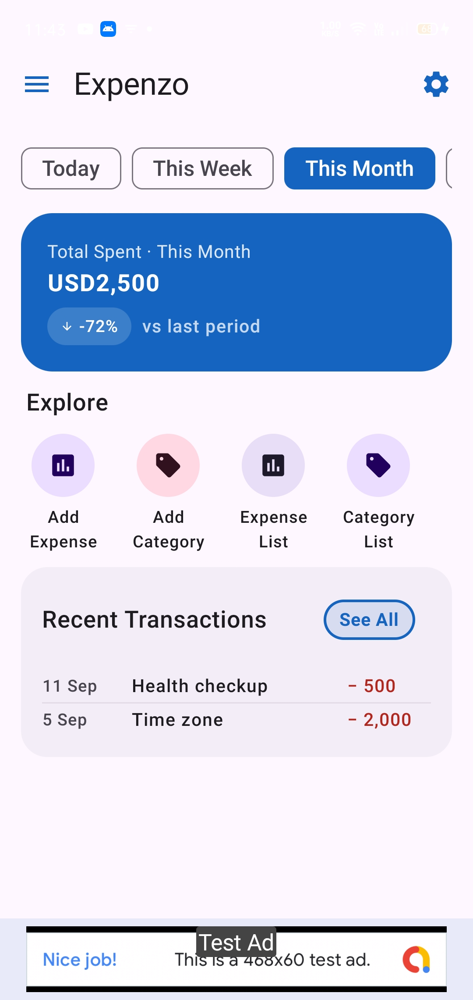
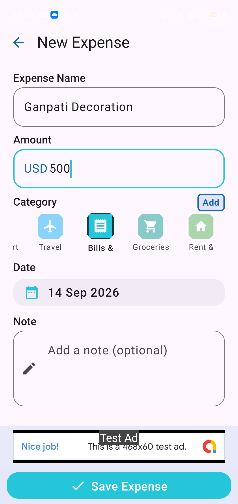
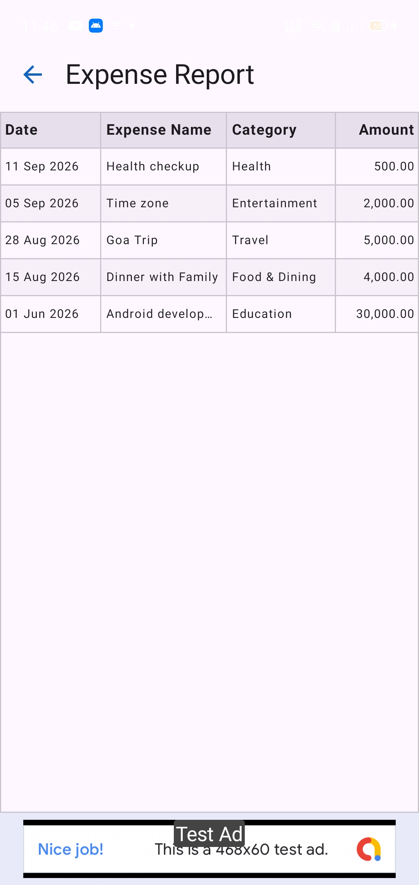
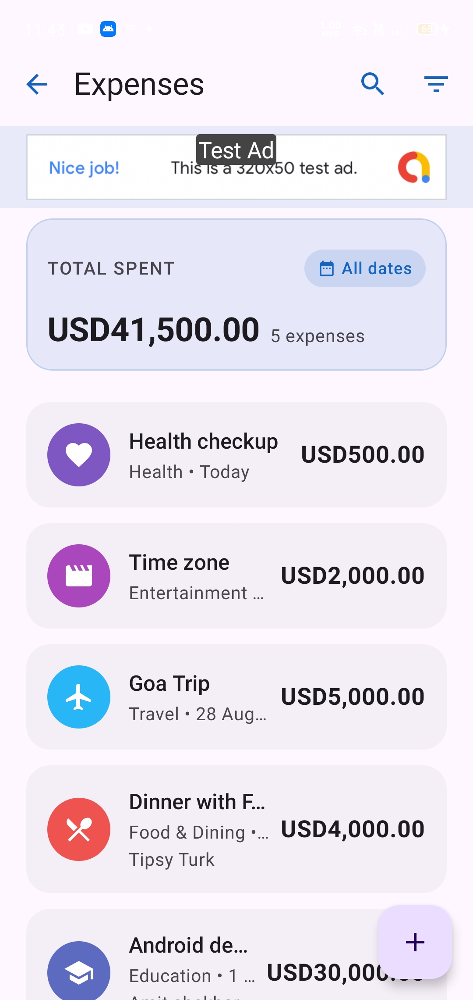
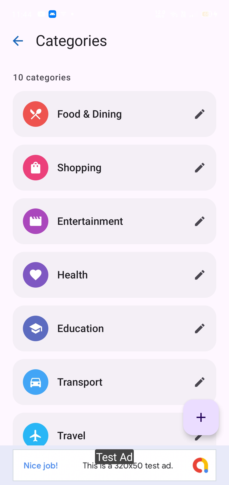
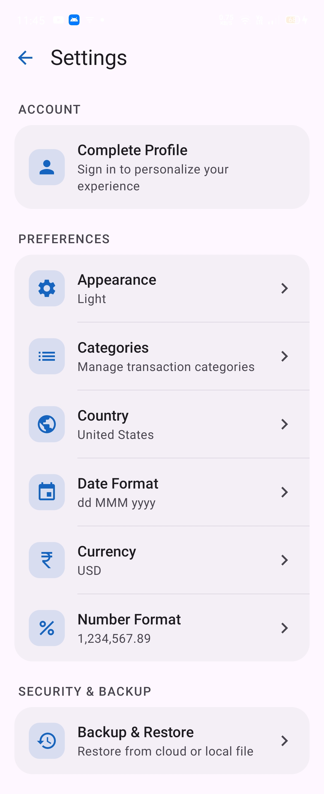
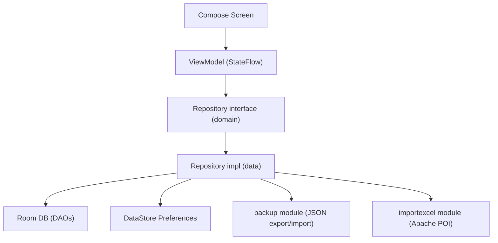

# Expenzo

Expenzo is a native Android expense tracker that helps people log spending, categorize it, and understand where their money goes through per-period dashboards and reports — all stored and processed **entirely on-device**.

---

## 📲 Get it on Google Play

<!-- TODO: replace with the live Play Store listing URL -->
[](https://play.google.com/store/apps/details?id=com.vibhorpatil.expenzo)

---

## Screenshots

| Home / Dashboard | Add Expense | Reports |
|:---:|:---:|:---:|
|  |  |  |

| Expense List | Categories | Settings |
|:---:|:---:|:---:|
|  |  |  |

---

## Features

- **Period-based dashboard** — spend totals for Today / Week / Month / Year with automatic percentage change vs. the previous period, computed from two parallel date-range queries
- **Custom category management** — create categories with a color and icon picker; a default category set is seeded automatically on first launch
- **Expense entry with validation** — regex-constrained amount input, inline field errors, and support for both add and edit flows from a single form
- **Spending trend chart** — a hand-drawn `Canvas` bar chart (no charting library) that adapts its buckets to the selected period (daily for a week, weekly for a month, monthly for a year)
- **Category breakdown** — spend grouped and sorted by category for the selected period
- **Detailed reports screen** — a filterable, formatted list of all expenses respecting the user's chosen currency, date format, and number format
- **Excel batch import/export** — generate a blank `.xlsx` template (Apache POI) into Downloads, fill it offline, then bulk-import expenses with a preview step before committing to the database
- **Local backup & restore** — export the entire database (expenses, categories, settings, profile) to a portable JSON file and restore from it later, via a custom streaming backup engine
- **Locale-aware formatting** — configurable currency, country, date format, and number format, each persisted independently and applied consistently across dashboard and reports
- **Theming** — light/dark/auto appearance modes, Material You dynamic color on Android 12+, and a set of custom color palettes as a fallback
- **Onboarding flow** — first-run profile setup before the user reaches the main dashboard
- **Local profile lock** — email/password credentials stored locally via DataStore (no backend account system)
- **Privacy-compliant ads** — Google UMP consent flow (GDPR/UK) gates AdMob initialization; test and production ad units are split by build type

---

## Tech Stack

| Category | Technology |
|---|---|
| Language | Kotlin 2.1 |
| UI | Jetpack Compose (Material 3) |
| Architecture | MVVM + Repository pattern |
| Dependency Injection | Hilt |
| Async | Kotlin Coroutines + Flow (`StateFlow`, `combine`, `flatMapLatest`) |
| Local Database | Room |
| Local Key-Value / Settings Storage | Jetpack DataStore (Preferences) + kotlinx.serialization |
| Navigation | Jetpack Navigation for Compose (multiple per-activity nav graphs) |
| Image Loading | Coil |
| Animations | Lottie |
| Excel I/O | Apache POI (custom `importexcel` module) |
| Backup/Restore | Custom streaming JSON engine (`backup` module) |
| Ads | Google Mobile Ads (AdMob) + User Messaging Platform (UMP) |
| Analytics / Crash Reporting | Firebase Analytics + Firebase Crashlytics |
| Testing | JUnit 4, Mockito, Turbine (Flow testing) |
| Build | Gradle Kotlin DSL, KSP, version catalogs (`libs.versions.toml`) |

There is no networking layer (Retrofit/OkHttp/Ktor) — the app is fully offline by design, and Firebase is used only for analytics and crash telemetry, not as a data backend.

---

## Architecture

Expenzo follows **MVVM with a repository layer**, split across three Gradle modules:

- **`app`** — the Android application: Compose UI, ViewModels, Room database, DataStore, Hilt modules
- **`importexcel`** — a standalone library module wrapping Apache POI for reading/writing `.xlsx` files, with no dependency on `app`
- **`backup`** — a standalone library module that serializes/deserializes an app-agnostic table representation (`BackupTable` / `BackupValue`) to JSON

Within `app`, code is layered as `data` → `domain` → `presentation`:

- **`domain/repositories`** defines repository interfaces (`ExpenseRepository`, `CategoryRepository`, `SettingRepository`, etc.) — the contract ViewModels depend on
- **`data/local/repositoriesImpl`** implements those interfaces against Room DAOs and DataStore
- **`presentation/<feature>`** holds one `@HiltViewModel` + Compose screen per feature (dashboard, expense, category, report, settings, backup/restore, batch upload, auth)

ViewModels expose a single `StateFlow<UiState<T>>` per screen (`UiState` is a sealed `Loading / Success / Error` type), built with `combine`/`flatMapLatest` over repository flows and shared with `stateIn(WhileSubscribed(5_000))`. Settings such as currency, date format, and appearance are stored as serialized JSON in DataStore and exposed through a generic `observeSetting()` extension so every screen reads the same source of truth reactively.



The app has **three activities**, each hosting its own Compose `NavHost`: `DashboardActivity` (main flow: dashboard, expenses, categories, reports, backup, batch upload, onboarding), `ReportActivity`, and `SettingActivity`. Dependencies are wired with Hilt (`@HiltAndroidApp`, `@AndroidEntryPoint`, `@HiltViewModel`), and app-wide coroutine scope/dispatchers are provided as qualified singletons (`@ApplicationScope`, `@IoDispatcher`, `@DefaultDispatcher`) so they can be swapped in tests.

---

## Project Structure

```text
app/src/main/java/com/vibhorpatil/expenzo/
├── app/                        # Application class, first-launch bootstrap
├── data/
│   ├── local/
│   │   ├── database/           # Room database, DAOs, entities
│   │   ├── datastore/          # DataStore wrappers (onboarding, auth, analytics, category seed)
│   │   ├── repositoriesImpl/   # Repository implementations
│   │   └── storage/            # Profile image storage
├── di/                         # Hilt modules (AppModule, CoroutinesModule)
├── domain/
│   ├── model/                  # Serializable setting models (currency, date, number, appearance)
│   └── repositories/           # Repository interfaces
├── presentation/
│   ├── dashboard/              # Dashboard screen, nav graph, expense & category sub-features
│   ├── report/                 # Report screen + activity
│   ├── setting/                # Settings, account, preferences, security (backup/restore, batch upload)
│   └── uiutils/                # Shared UiState, top bars, formatting helpers
├── ui/theme/                   # Compose theme, color palettes, typography
└── utility/                    # Constants, DB schema strings, Crashlytics logger, consent manager

importexcel/    # Apache POI-based Excel read/write module
backup/         # JSON backup/restore serialization module
```

---

## Key Implementation Details

**Reactive dashboard with derived comparisons** — `DashboardViewModel` computes the current and previous date range for the selected period, runs both as parallel Room queries via `combine`, and derives totals, percentage change, category breakdown, and trend points in one place, re-emitting automatically whenever the period changes (`flatMapLatest`) or the underlying data changes.

**Generic settings pipeline** — rather than one DataStore key per setting, `SettingRepository.observeSetting()` deserializes any `@Serializable` setting type from a single Preferences store by key, with a typed default. Currency, country, date format, number format, and appearance all reuse the same read/write path.

**Decoupled backup engine** — the `backup` module knows nothing about Room; `BackupEntityMappers` in `app` converts entities to/from `BackupTable`/`BackupValue`, and `BackupWriter`/`BackupReader` stream JSON via `JsonWriter`/`JsonReader` so memory usage stays flat regardless of database size.

**Excel batch import with a preview step** — `BatchUploadViewModel` generates a template via `MediaStore` (API 29+) or legacy file APIs (below), the user fills it externally, and `ExcelPreviewScreen`/`ExcelPreviewViewModel` parse it with `ReadExcel` before anything is written to Room, so bad rows can be caught before commit.

**Consent-gated monetization** — `ConsentManager` wraps Google's UMP SDK and blocks `MobileAds.initialize()` until `ConsentInformation.canRequestAds()` is true, run on every launch as required for EEA/UK compliance; debug builds are wired to Google's public test ad unit IDs so development never risks serving (or accidentally clicking) live ads.

**Cold-start optimization** — `Expenzo.onCreate()` moves Firebase Analytics allocation, the onboarding-flag DataStore read, and default-category seeding onto a background `@ApplicationScope` coroutine, so the splash screen's blocking read is served from an already-warm cache instead of adding its own disk I/O to startup.

---

## Testing

- **Framework**: JUnit 4 with `MockitoJUnitRunner` for mocking repository dependencies, and Turbine for asserting `Flow` emissions
- **Coverage focus**: repository-layer unit tests (`ExpenseRepositoryImplTest`, `CategoryRepositoryImplTest`) verifying that repository methods correctly delegate to and transform data from the DAO layer, including category-seeding behavior
- Compose UI testing and Espresso dependencies are configured in Gradle, but only the default generated instrumented test is currently present — UI/instrumented test coverage is not yet built out
